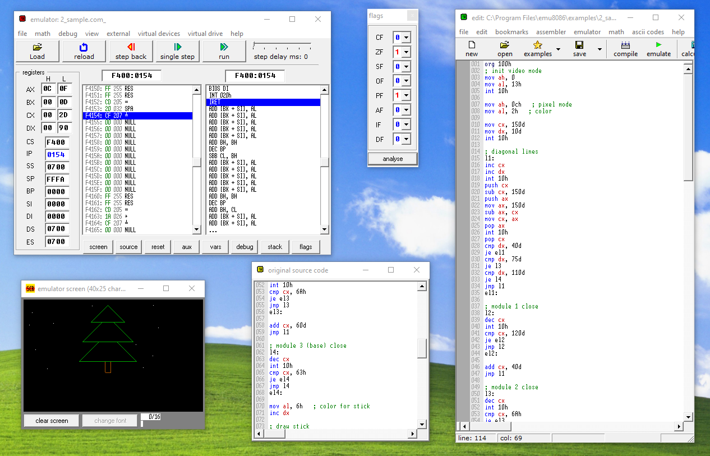

# EMU8086 - Эмулятор i8086 для Windows

Продвинутый графический эмулятор с ассемблером для Windows.

Имеется множество дейвайсов, таких как LED Display, Screen Emulator и т.д.



## Как установить?

[Скачайте установщик](emu8086v408r.exe) и установите программу. После этого активируйте ее следующим ключем:

```txt
name: AggressioN
code: 27RPXJKASEAKDLSR2ERKRTQZ
```

К сожалению, разработка программы давно заброшена, автор больше ее не обновляет. И при всем желании купить ее уже не удасться.

Разумеется заброшенность программы никак не повлияет на актуральность i8086 :3

## Совместимость с i8086gui

Адреса девайсов немного отличаются. Потребуется небольшая конвертация. Соответствующая информация будет опубликована позже.

---

by emu8086.com
