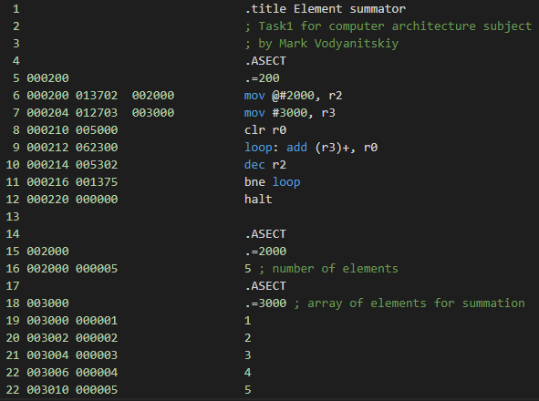

# Element summator

## Задача

Сложить массив цифр и записать ответ.

## How to use

Input digits to 3000+. Set to 2000 amount of digits. Run. Answer stored in R0.

* Software used: SIMH PDP-11 simulator V3.8-1
* Simulation file save: task1.sim
* deposit commands list: simh.txt

