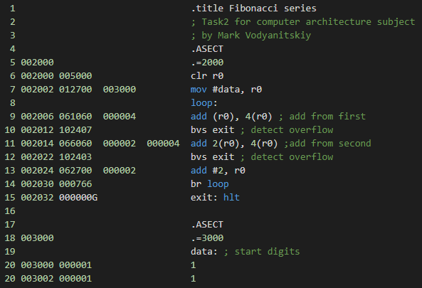

# Fibonacci series

## Задача

Сделать расчет чисел Фибоначчи (до тех пор, пока не произойдет переполнение).

## How to use

Just run. Answer stored as array of digits in 3000+.

* Software used: SIMH PDP-11 simulator V3.8-1
* Simulation file save: task2.sim
* deposit commands list: simh.txt

