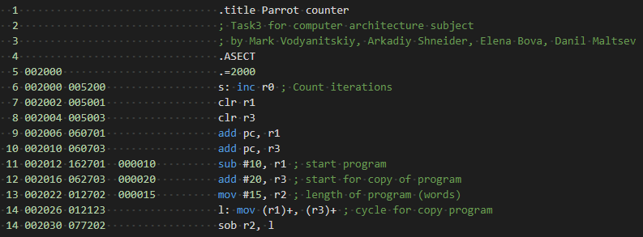

# Parrot counter

## Задача

Написать программу, делающую свою копию в последующую за ней область памяти и передающую управление новой копии. Новая копия снова создает копию и т.д., до тех пор пока память не закончится (вызов прерывания). Нужно подсчитать количесво влезших копий.

## How to use

Just run. Answer stored in register R0.

* Software used: SIMH PDP-11 simulator V3.8-1
* Simulation file save: task3.sim
* deposit commands list: simh.txt

