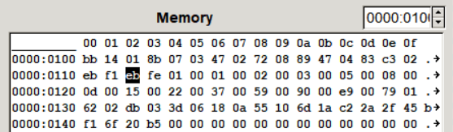

# Fibonacci series for i8086

## Задача

Сделать расчет чисел Фибоначчи (до тех пор, пока не произойдет переполнение).

## How to use

Just run. Answer near program (after last instructions).

* Pre-assembled file (via nasm): `task4_lp`
* Standart code: `task4.asm`
* Code for i8086gui (with loop-end): `task4_lp.asm`

