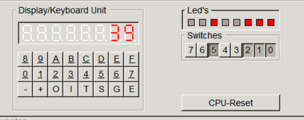

# Display digit using base

## Задача

Работа выполняется на эмуляторе i8086gui

Прочитать число с переключателей и вывести на 8-и сегментных индикаторах. В коде должа присутствовать возможность указать систему счисления (от 2 до 16). Не значащие нули нужно скрывать.

## How to use

```bash
nasm task5.asm
```

After that, load `task5` to i8086gui.

* Pre-assembled file (via nasm): [task5](task5)
* Standart code: [task5.asm](task5.asm)

