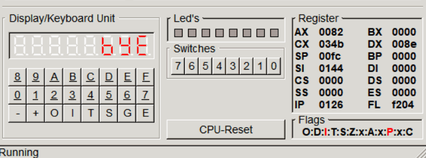

# Ticker

## Задача

Работа выполняется на эмуляторе i8086gui

Вывести на 8-и сегментных индикаторах бегущую строку с текстом "bye-bye i8086!"

## How to use

```bash
nasm task6.asm 
```

After that, load task6 to i8086gui.

* Pre-assembled file (via nasm): [task6](task6)
* Standart code: [task6.asm](task6.asm)

