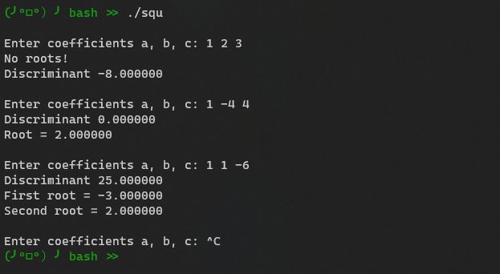

# Calculate quadratic equation for 8087

## Задача

Решение квадратного уравнения с помощью команд сопроцессора.

В данной работе ввод коэффициентов квадратного уравнения производится в программе на C, вывод результата - тоже.

1. Необходимо выполнить преобразование ассемблерного кода программы в 100% 64-разрядный формат, заменив системные выводы на вызовы 64-разрядного ядра Linux.
2. Выполнить сохранение регистров при входе в подпрограмму sq_eq и их восстановление перед возвратом (команда ret). Проверить правильность решения и значения дискриминанта. Сделать отдельный вывод случая, когда d==0 (один корень).
3. Прокомментировать все действия в коде. [Краткая справка по командам сопроцессора](8087_InstructionSet.txt).

