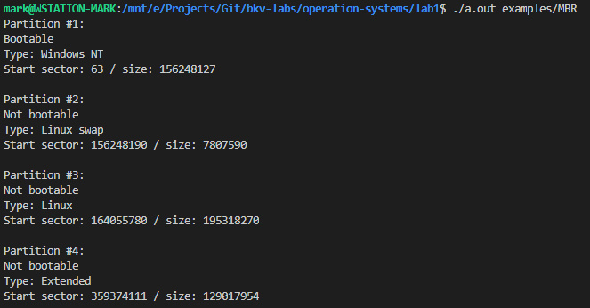

# Информация о разделах

## Задача

Получить информацию о разделах из загрузочной области MBR. На вход программе могут подавать файлы (такие, как в папке [examples](examples)) или на файл диска (например `/dev/sda`).

Вывести:

* Загрузочный / не загрузочный
* Тип файловой системы
* Стартовый сектор
* Размер раздела (в секторах)

## Документация

* [Типы файловых систем](filesystems.md)
* [Как выглядит MBR](os-partitions.md)

## Пример работы

## ПРЕДУПРЕЖДЕНИЕ

**Программа работает только под Linux.**

Собственно по заданию она как раз и должна быть заточена под исчадье пингвинов. Хотя данную версию не сложно портировать под винду простой заменой аналогичных функций.