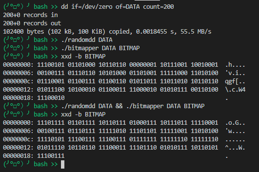

# Битовая карта секторов

## Задача A

Записать рандомные символы в файл, заполненный нулями, имитируя занятые сектора.

Файл может быть получен командой:

```bash
dd if=/dev/zero of=<имя_файла> count=<кол_во_секторов>
```

## Задача B

Прочитать полученный файл из задания A и сделать битовую карту занятых секторов. Одним символом записывается информация о 8-и секторах, где `1` - сектор занят, `0` - сектор свободен.

## Общая задача для задач

Все две программы должны иметь возможноть работать одновременно. Соответственно требуется применять частичную блокировку файла, используя функцию `lockf`.

## Пример работы



## ПРЕДУПРЕЖДЕНИЕ

**Программа работает только под Linux.**