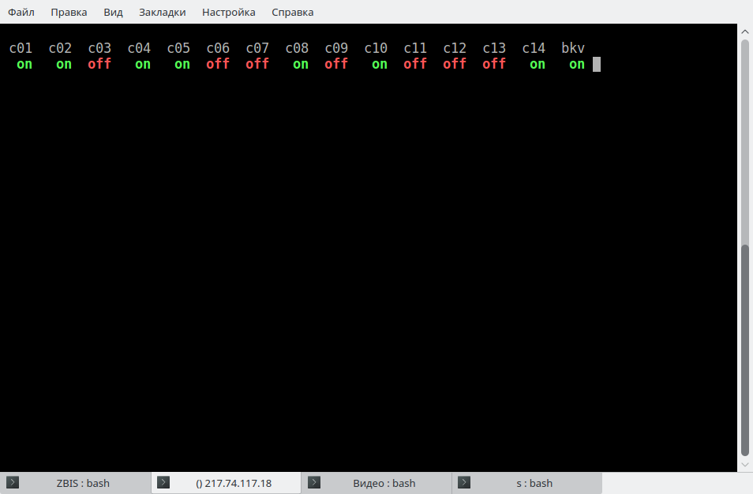

# Мониторинг компьютеров утилитой ping

Утилита ping предназначена для проверки наличия соединения и качества связи. Ее можно использовать для проверки состояния удаленного хоста (включен или нет). Программа посылает специальные ICMP пакеты, а адресат возвращает их обратно. Если компьютер выключен, то пакет обратно не придет. Основные опции командной строки этой утилиты:<br>
-c n    количество посылаемых пакетов;<br>
-W n    время ожидания возврата пакетов;

В файле с именем hosts.txt (далее приводится пример) находится список хостов, которые необходимо проверять на предмет доступности и выводить в удобном виде, например, в верхней строке консольного окна - имена компьютеров из 2-4 символов, во второй строке - под этими именами выводится on или off, on - включен, off- выключен. on нужно вывести зеленым цветом, off - красным. Вывод повторять через каждые 10 секунд.

Для установки курсора при выводе в нужное место экрана и смены цвета использовать ANSI-escape последовательность: \033 - код символа Escape. Далее приведены некоторые Esc-последовательности:
- Положение курсора:<br>
  `\033[<L>;<C>H`       вместо угловых скобок должны стоять целые числа L - номер строки, C - номер символа в строке<br>
  `\033[<L>;<C>f<br>` - поместить курсор в позицию C на строке  L.
- Очистить экран, курсор в начало (0,0): `\033[2J`
- Стереть до конца строки: `\033[K`
- Установить цвет выводимых символов: `\033[<C>;<B>m`

Сочетания C и B задают цвета:
| Название цвета | Код  | Название цвета | Код  |
| -------------- | ---- | -------------- | ---- |
| Black          | 0;30 | Dark Gray      | 1;30 |
| Red            | 0;31 | Light Red      | 1;31 |
| Green          | 0;32 | Light Green    | 1;32 |
| Brown/Orange   | 0;33 | Yellow         | 1;33 |
| Blue           | 0;34 | Light Blue     | 1;34 |
| Purple         | 0;35 | Light Purple   | 1;35 |
| Cyan           | 0;36 | Light Cyan     | 1;36 |
| Light Gray     | 0;37 | White          | 1;37 |

Например:<br>
Определить цветовые переменные:<br>
`RED='\033[0;31m'`<br>
`NC='\033[0m'`

Использование:
echo -e "$RED This is красный $NC"
--------------------------------
Пример содержимого файла hosts.txt:
```cpp
c01 10.40.14.101
c02 10.40.14.102
c03 10.40.14.103
c04 10.40.14.104
c05 10.40.14.105
c06 10.40.14.106
c07 10.40.14.107
c08 10.40.14.108
c09 10.40.14.109
c10 10.40.14.110
c11 10.40.14.111
c12 10.40.14.112
c13 10.40.14.113
c14 10.40.14.114
bkv 10.40.24.2
```

Примерный вид консольного окна с запущенным скриптом на рисунке:

